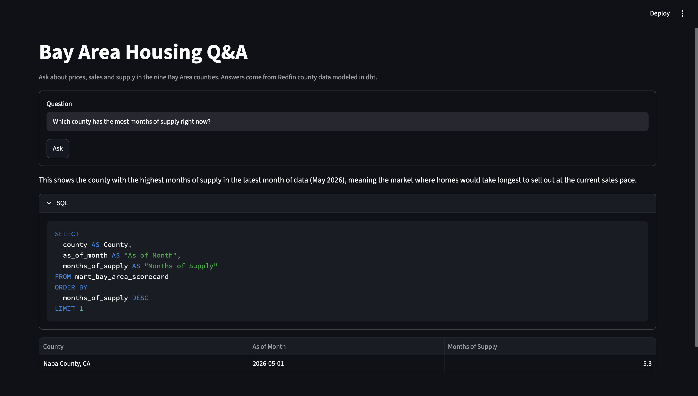
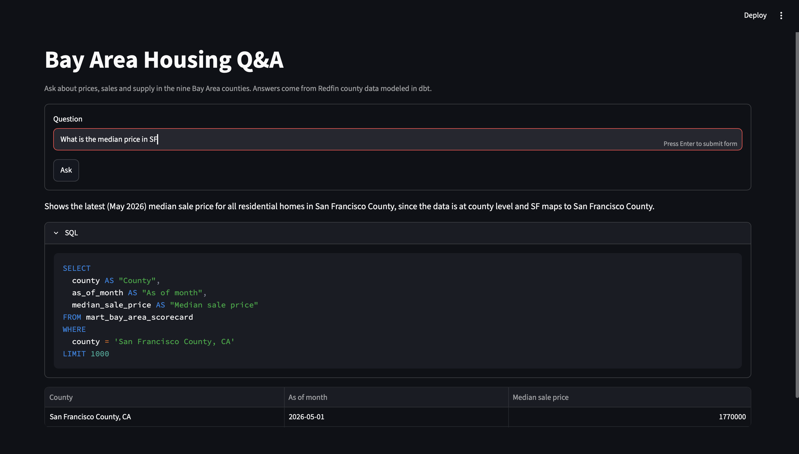
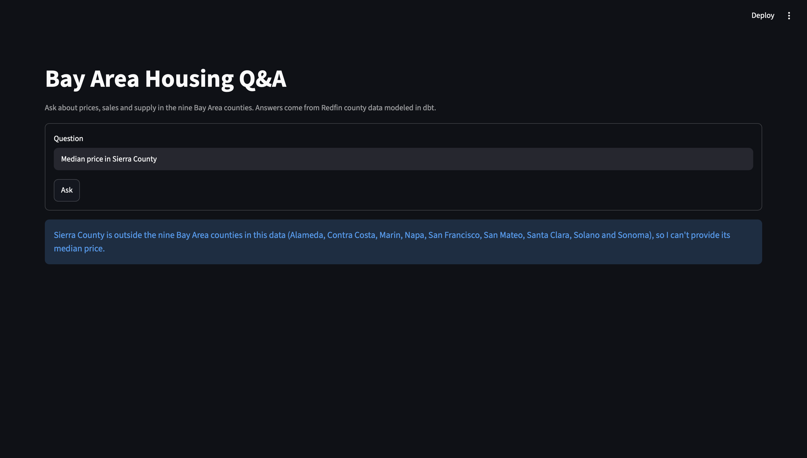

# Bay Area Housing Q&A

A natural-language interface for the Bay Area housing dbt project. A user asks a question in plain English, and the app returns a one-line explanation, the SQL it ran, and the result table. Claude writes the SQL against the three dbt mart tables, and a two-layer safety design checks and runs it. An evaluation set measures how often the answers are right.







## What it does

- Maps short names such as "SF" and "San Jose" to the exact county strings in the data.
- Declines questions the data cannot answer, such as rent or counties outside the nine in scope.
- Shows the SQL behind every answer so a reader can check it.
- Sends a failed query and its error back to Claude once, so a small mistake can be corrected before the user sees an error.

## How it works

1. **Schema context.** At startup the app builds a description of the three marts from the live data and the dbt descriptions. It includes column names and types, the exact county strings, the property types, the date range, and rules for reading the moving-average columns.
2. **Claude call.** The question and the schema context go to Claude, which returns a status (answer or decline), a single SQL statement, and a one-line explanation.
3. **Validation.** A parser-based guard checks the SQL before anything runs.
4. **Execution.** The query runs in a fresh in-memory DuckDB database that holds only the three marts.
5. **Display.** The Streamlit page shows the explanation, the SQL, and the result table, with notes when results were corrected, truncated, or empty.

## Safety model

Generated SQL is treated as untrusted input, and two independent layers sit between the model and the data.

**Layer one, the SQL guard (`sql_guard.py`).** The guard parses the query with sqlglot and rejects anything it cannot positively classify as safe.

- Exactly one statement, and it must be a `SELECT` or a set operation.
- No write, schema, or session statements anywhere in the query, including inside subqueries and CTEs.
- Every table must be one of the three marts or a CTE defined in the same query. Scope analysis decides what each name really points to, because in DuckDB a CTE named like a real table can still read the real table.
- No qualified names, table functions, or functions that read files, environment variables, or settings.
- A row limit is added when missing, and the rebuilt SQL is what runs, so the text that was checked is the text that executes.

**Layer two, the query runner (`db.py`).** If a query ever got past the guard, it would find almost nothing to attack.

- Each query gets its own in-memory database built from a cached snapshot of the three marts, so one query cannot affect the next.
- External access is disabled and the configuration is locked before the query runs.
- Each query has a memory limit, a timeout that interrupts the query, and a cap on fetched rows.
- The snapshot reloads when the DuckDB file changes, so rebuilding the marts with dbt does not require a restart.

The API key is read only from the environment or the project's `.env` file, is never printed, and is scrubbed from any error message.

## Why only the marts

The marts already encode the grain decisions made in the dbt project. Pointing the model at staging or raw tables would invite wrong answers, such as summing across property types while the All Residential aggregate rows are still present.

## Quickstart

Build the dbt project first so the DuckDB file exists, then install the app dependencies.

```bash
dbt build --profiles-dir .
pip install -r app/requirements.txt
```

Create a `.env` file in the project root with a key from the Claude Console. The Console is a separate account from a Claude Pro subscription and bills by usage.

```
ANTHROPIC_API_KEY=your-key-here
```

Run the app.

```bash
streamlit run app/streamlit_app.py --server.address localhost
```

The `--server.address localhost` flag keeps the app off the local network, so nobody else on the same Wi-Fi can spend your API credit.

## Configuration

| Variable | Purpose | Default |
|---|---|---|
| `ANTHROPIC_API_KEY` | API key | none, required |
| `CLAUDE_MODEL` | Model that writes the SQL | `claude-sonnet-5-5` |
| `CLAUDE_EFFORT` | Reasoning effort | `medium` |
| `APP_MEMORY_LIMIT` | Memory limit for each query database | 256MB |

## Evaluation

The eval set has 12 questions, each run 3 times (36 runs), scored automatically against reference SQL that runs at eval time, so expected answers stay correct when the data refreshes. Nine questions were available during prompt design, and three were held out and run once after the prompt was final.

| Split | Questions | Runs passed | Questions passing every run |
|---|---|---|---|
| Tuning | 9 | 27 of 27 | 9 of 9 |
| Held out | 3 | 9 of 9 | 3 of 3 |

Run on 2026-10-01 with claude-sonnet-5-5. Total API cost for all runs was about $0.47.

The questions cover ranking and counting, trends over time, short county names such as "SF" and "San Jose", property-type breakdowns, the 12-month moving-average rule (including a Marin Townhouse question where an unfiltered query returns a wrong month), one question the data cannot answer, and two unsafe requests.

Scoring ignores column names and row order. For single-value questions, the reference value can appear in any column of the answer's first row, so a correct answer in a different layout still passes.

Limits to keep in mind

- The set is small, and the questions are direct. A perfect score here does not mean the app is right every time.
- The tuning split passed on the first run, so the prompt was not adjusted in response to any result.
- The prompt and the questions were written from the same project, so the prompt may anticipate them.
- The unsafe requests were declined by the model before any SQL was generated. The SQL guard was not exercised by the live eval. Its adversarial tests and the database runner's hostile-query tests cover that path without calling the API.

Run the eval from the `app` folder.

```bash
python eval/run_eval.py                   # tuning split
python eval/run_eval.py --split held_out  # held-out questions, final check only
python eval/run_eval.py --check           # validates the reference SQL, no API calls
```

## Files

| File | Role |
|---|---|
| `streamlit_app.py` | Page layout and display states |
| `pipeline.py` | Question to SQL to validation to result, shared by the page and the eval |
| `llm.py` | Claude call, structured output, one retry |
| `schema_context.py` | Builds the schema text Claude sees |
| `sql_guard.py` | Parser-based validation |
| `db.py` | Isolated, resource-limited query runner |
| `config.py` | Settings from the environment and `.env` |
| `try_questions.py` | Runs a few questions end to end from the terminal |
| `eval/questions.yaml` | Eval questions, reference SQL, and expected outcomes |
| `eval/run_eval.py` | Eval runner and scoring |
| `eval/guard_cases.txt` | Queries the guard accepts and rejects, generated from the tests |
| `tests/` | Offline tests for the guard, runner, pipeline, page, and eval scoring |

## Tests

```bash
cd app
pytest                 # full suite
pytest -m "not slow"   # skips the timeout and memory stress tests
```

The suite has 206 tests, and none of them call the API. The guard tests include adversarial queries, such as nested CTEs that shadow a mart name and semicolons inside string literals. The runner tests send hostile queries straight to `db.py`, bypassing the guard, to show that the second layer holds on its own.

## Limitations

- The model can still write a query that runs and answers the wrong question. Showing the SQL lets a reader catch this, and it is the reason the SQL is never hidden.
- The data covers nine Bay Area counties at a monthly grain, from Redfin's county market tracker.
- In `mart_bay_area_price_trends`, each county's first 11 months of moving average cover fewer than 12 months. The app is told this and avoids those rows when a question depends on a full window.
- Results appear as tables only.
- The app is a local demo. A public deployment would need exported data files, a rate limit, and a spending cap.
